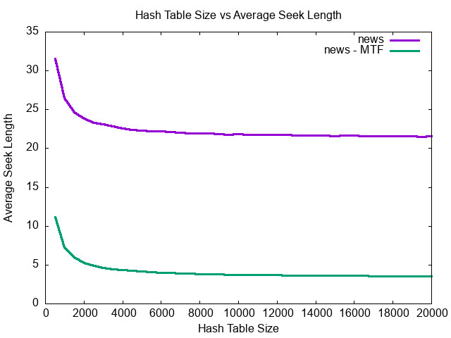
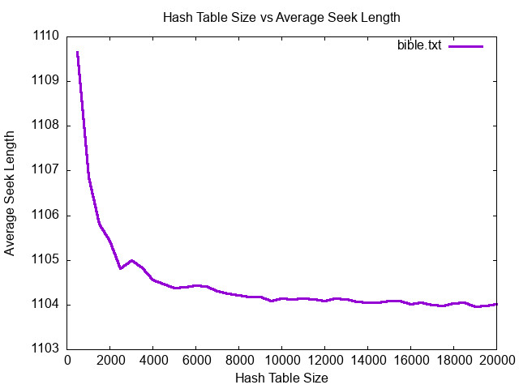
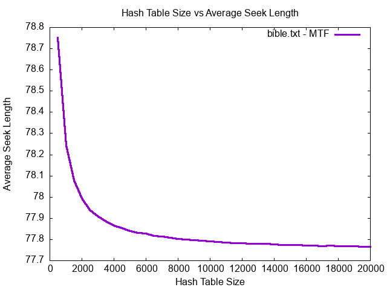
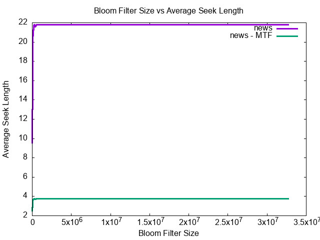
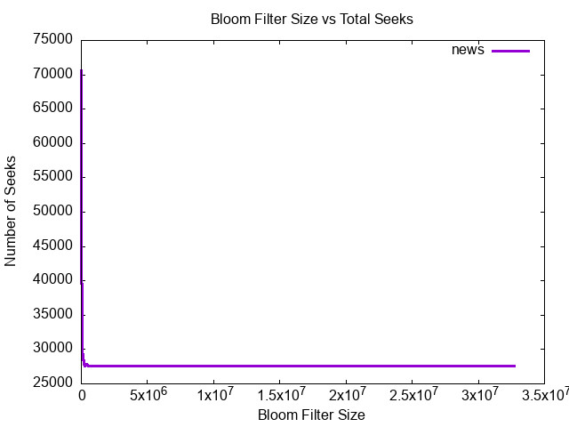

In Assignment 7 I wrote a program that utilized Hash Tables and Bloom Filters to enforce rules in the country I was "leading". I learned about what bloom filters and hash tables were and how they can effectively be used to make programs more efficient. I conducted a couple of experiments to further understand how bloom filters and hash tables work.

## Varying Hash Table Size

First I wanted to see how varying the hash table size would would affect the total number of seeks and the average seek length. When I ran these experiments I kept bloom filter size constant (the default size). I found that changing the size of the hash table had no effect on the total number of seeks. This is expected since the program is only seeking if the probe from the bloom filter returns true. Since the bloom filter is kept constant the results of the bloom filter will stay the same hence the total number of seeks stays the same. However I did notice there was a difference in the average seek length as the size of the hash table changed. This can be seen in the graphs below

These two graphs show that as the size of the Hash Table increases the Average seek length decreases at an exponential rate. The seek lengths are different for the different files because the size of each file is different. As the hash table size increases the linked lists get shorter. It is also apparent that with the Move to front flag enabled the seek lengths greatly reduces since move to front is a simple predictor of the upcoming words. For the bible the seek length went from over 1000 to 70 with move to front enabled.

## Varying Bloom Filter Size

In my next group of experiments I kept the size of the Hash table constant and varied the size of the bloom filter. The results from the graph is shown below.

These two graphs show how the average seek length and the total number of seeks change as the bloom filter size changes. When the bloom filter is small the number of seeks is extremely high. However as the size of the bloom filter increases the total seeks exponentially decreases. The opposite happens for the seek length as when the bloom filter size increases the average number of seeks also exponentially increases. Increasing the bloom filter size decreases the number of lookups in the hash table

Move to front only has an effect on the average seek length and does nothing to the total seeks. The graph shows that with MTF enabled the average seek length drops from 22 to only 4.
